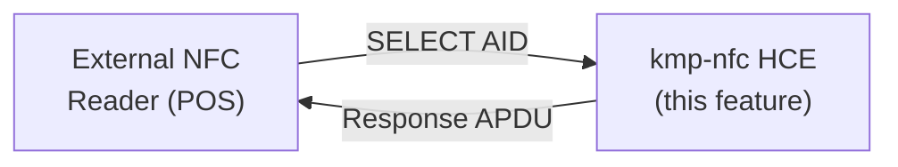
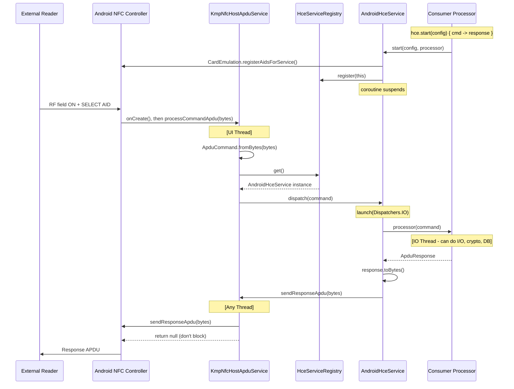
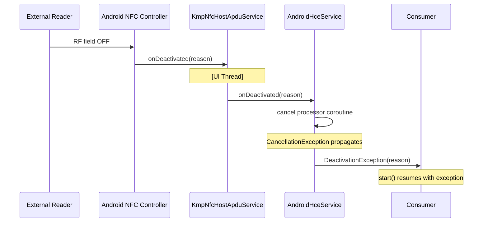
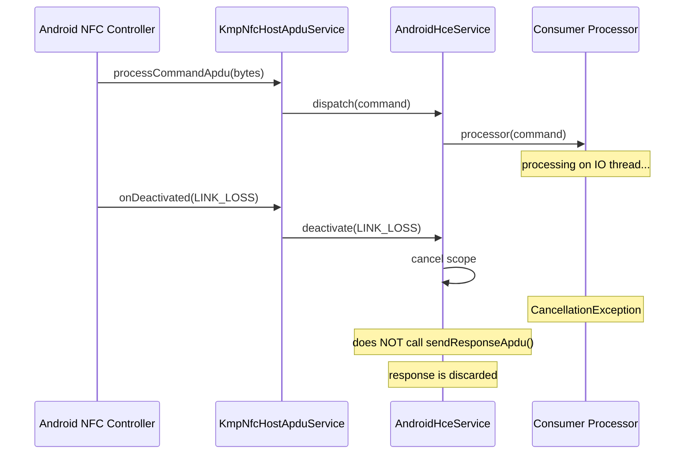
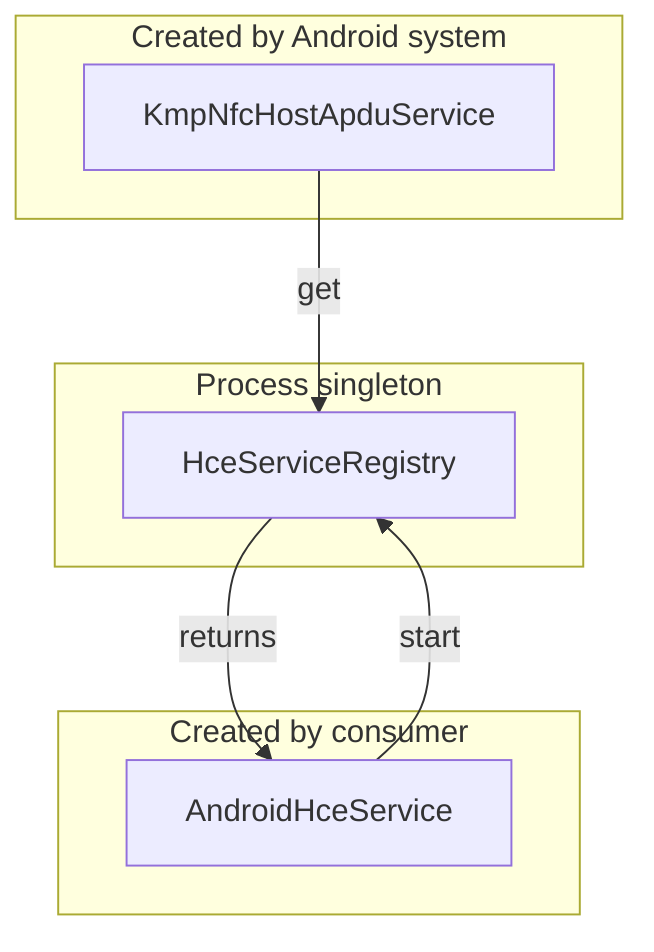

# HCE Architecture

Host Card Emulation for `kmp-nfc` - design rationale, threading model, platform
wire-up, and testing strategy.

## Overview

HCE lets a phone act as a contactless smart card. An external NFC reader sends ISO
7816-4 APDU commands to the device, and the app responds. This is the inverse of the
existing `NfcAdapter.tags()` reader mode - the device is the *target*, not the
*initiator*.



## Why a Separate Entry Point

`NfcAdapter` is the reader/writer entry point - it *initiates* communication
(`tags()` cold Flow: collect starts session, cancel ends it). HCE is the
*passive* role - the system calls you when a reader sends a command. These are
fundamentally different lifecycles and threading models. Forcing HCE into
`NfcAdapter` would muddy the API and create confusing "start reader or start
emulation?" initialization paths.

```mermaid
graph TB
    subgraph "Reader Mode (existing)"
        NA[NfcAdapter] -->|cold Flow| Tags[Flow of NfcTag]
        Tags -->|collect| Read[NdefMessage]
    end
    subgraph "Card Emulation (new)"
        HS[HceService] -->|suspend fun| Start[start processor]
        Start -->|each APDU| Proc[processor: suspend (ApduCommand) -> ApduResponse]
    end
```

## Module Layout

```
commonMain/kotlin/com/atruedev/kmpnfc/hce/
  HceService.kt           interface + expect factory
  HceConfig.kt             AidRegistration, AidCategory, config data class
  HceCapabilities.kt       per-platform feature probe
  DeactivationReason.kt    why the session ended

androidMain/kotlin/com/atruedev/kmpnfc/hce/
  AndroidHceService.kt             actual implementation
  KmpNfcHostApduService.kt         HostApduService subclass (system entry point)

iosMain/kotlin/com/atruedev/kmpnfc/hce/
  IosHceService.kt                 NOT_SUPPORTED stub (EEA gate)

jvmMain/kotlin/com/atruedev/kmpnfc/hce/
  JvmHceService.kt                 NOT_SUPPORTED stub

commonTest/kotlin/com/atruedev/kmpnfc/hce/
  HceServiceTest.kt                unit tests

kmp-nfc-testing/commonMain/.../testing/
  FakeHceService.kt                test double

NfcCapabilities.kt (modified)      +canHostCardEmulation: Boolean
```

## API Design

### Core Interface

```kotlin
public interface HceService {
    public val capabilities: HceCapabilities

    /**
     * Start card emulation. Suspends until [stop] is called or the external
     * reader disconnects.
     *
     * [processor] runs on a background dispatcher - the consumer can perform
     * I/O, crypto, or database lookups without blocking the NFC stack.
     *
     * @throws DeactivationException if the reader disconnects.
     * @throws NfcException if configuration fails (AID conflict, NFC off, etc).
     */
    public suspend fun start(
        config: HceConfig,
        processor: suspend (ApduCommand) -> ApduResponse,
    )

    /** Stop emulation. [start] returns normally. */
    public fun stop()
}

public expect fun HceService(): HceService
```

### Why `suspend (ApduCommand) -> ApduResponse`

Three designs were evaluated:

| Design | Consumer API | Android Threading | Verdict |
|--------|-------------|-------------------|---------|
| **A) Callback** | `fun start(listener: HceListener)` - `listener.processCommand()` returns `ApduResponse` synchronously | Force consumer to run on UI thread | Rejected - blocks UI thread |
| **B) Flow + respond()** | Consumer collects `Flow<ApduCommand>` and calls `respond(ApduResponse)` | `processCommandApdu()` must block until `respond()` is called - UI thread stall | Rejected - UI thread stall is a platform violation |
| **C) Suspend processor** | `suspend fun start { command -> response }` | `processCommandApdu()` launches coroutine on `Dispatchers.IO`, calls `sendResponseApdu()` when done, returns `null` immediately | **Chosen** |

Android's `HostApduService.processCommandApdu()` runs on the **UI thread**.
Returning `null` and calling `sendResponseApdu()` from a background thread is
the documented async pattern. Design C maps directly to this.

### Error Model

Two categories of error:

**Configuration errors** (thrown before `start()` suspends - use existing `NfcException`):

```
NfcError (sealed interface)
  AdapterError
    NotSupported        - no NFC hardware
    AdapterDisabled     - NFC is off
    Unauthorized        - permission denied
  HceError (new sealed interface)
    AidConflict         - another app registered the same AID
    PaymentNotDefault   - payment AIDs but app not default wallet
```

**Runtime deactivation** (thrown AFTER `start()` is suspended):

```kotlin
class DeactivationException(
    val reason: DeactivationReason,
) : Exception("HCE deactivated: $reason")

enum class DeactivationReason {
    LINK_LOSS,     // RF field lost (reader moved away)
    DESELECTED,    // AID deselected by reader
    STOPPED,       // consumer called stop()
}
```

`DeactivationException` is separate from `NfcException` because deactivation is
normal lifecycle, not a bug. The consumer catches it to clean up state, not to
log errors.

### Configuration Types

```kotlin
data class HceConfig(
    val aids: List<AidRegistration>,
    val requireDeviceUnlock: Boolean = false,
    val description: String? = null,
)

data class AidRegistration(
    val aid: String,             // hex: "F0010203040506"
    val category: AidCategory = AidCategory.OTHER,
)

enum class AidCategory { PAYMENT, OTHER }
```

### Capabilities Probe

```kotlin
data class HceCapabilities(
    val isSupported: Boolean,
    val canPaymentCategory: Boolean,
)
```

| Platform | `isSupported` | `canPaymentCategory` |
|----------|--------------|---------------------|
| Android | `true` | `true` |
| iOS | `false` (EEA gate) | `false` |
| JVM | `false` | `false` |

## Android Threading Model

This is the trickiest part of the design. Here is the full flow:



Key points:

1. `processCommandApdu()` **always returns `null`** - the library never blocks
   the UI thread, even if the processor is fast enough to respond synchronously.
   Consistency over micro-optimization.

2. `sendResponseApdu()` is called from the **IO dispatcher** where the processor
   runs. The Android docs confirm this is safe from any thread.

3. The coroutine is launched as a **child** of the `start()` scope. If the
   processor throws, the exception propagates to `start()`.

### Deactivation Flow



### Race Condition: Deactivation During Processing



When deactivation arrives while a processor is still running:

1. The processor coroutine is cancelled (`job.cancel()`).
2. The response (if any) is discarded - `sendResponseApdu()` is NOT called
   because the NFC controller has already torn down the RF link.
3. `start()` resumes with `DeactivationException(LINK_LOSS)`.

The `isActive` check in the coroutine ensures the processor can cooperatively
cancel long-running work.

## Singleton Registry

`KmpNfcHostApduService` is instantiated by the Android system. It needs to find
the `AndroidHceService` instance that the consumer started. A process-scoped
registry bridges the two:



```kotlin
internal object HceServiceRegistry {
    @Volatile
    private var instance: AndroidHceService? = null

    fun register(service: AndroidHceService) {
        check(instance == null) { "HCE service already active" }
        instance = service
    }

    fun unregister(service: AndroidHceService) {
        if (instance === service) instance = null
    }

    fun get(): AndroidHceService? = instance
}
```

`@Volatile` is sufficient here because:
- Only one writer at a time (single `start()` call enforced by `check`)
- `processCommandApdu()` is called sequentially by the system
- `get()` returns a stable reference for the session lifetime

No locks, no atomics, no `synchronized` - consistent with the project's
`limitedParallelism(1)` policy over mutexes.

## Android Manifest

The library manifest auto-merges into the consumer's app:

```xml
<uses-permission android:name="android.permission.NFC" />

<!-- HCE is optional - reader mode works without it -->
<uses-feature
    android:name="android.hardware.nfc.hce"
    android:required="false" />

<application>
    <service
        android:name="com.atruedev.kmpnfc.hce.KmpNfcHostApduService"
        android:exported="true"
        android:permission="android.permission.BIND_NFC_SERVICE">
        <intent-filter>
            <action android:name="android.nfc.cardemulation.action.HOST_APDU_SERVICE" />
        </intent-filter>
        <meta-data
            android:name="android.nfc.cardemulation.host_apdu_service"
            android:resource="@xml/kmp_nfc_hce_service" />
    </service>
</application>
```

The AID XML resource (`res/xml/kmp_nfc_hce_service.xml`) declares an empty AID
group:

```xml
<host-apdu-service
    xmlns:android="http://schemas.android.com/apk/res/android"
    android:requireDeviceUnlock="false">
    <!-- AIDs are registered dynamically at runtime via CardEmulation.registerAidsForService() -->
    <aid-group android:category="other" android:description="@string/kmp_nfc_hce_service_desc" />
</host-apdu-service>
```

This is deliberate: AIDs are determined by the consumer at runtime, not baked
into the library manifest. The manifest provides the service skeleton; the
consumer's `HceConfig` provides the actual AIDs.

## AID Registration Strategy

Dynamic registration (`CardEmulation.registerAidsForService()`) over manifest XML
because:

- AIDs are consumer-defined, not library-defined. The library can't know which
  AIDs the consumer wants to emulate.
- Dynamic registration supports runtime AID changes (e.g., user switches
  loyalty cards).
- Manifest XML requires the consumer to edit `res/xml/` files or use manifest
  placeholders - fragile and not idiomatic for a KMP library.

For `PAYMENT` category AIDs, the consumer must first check:

```kotlin
val cardEmulation = CardEmulation.getInstance(adapter)
if (!cardEmulation.isDefaultServiceForCategory(
        ComponentName(context, KmpNfcHostApduService::class.java),
        CardEmulation.CATEGORY_PAYMENT,
    )) {
    // Prompt user to set app as default Tap & Pay
}
```

The library throws `PaymentNotDefault` if payment AIDs are registered without
the app being the default wallet.

## iOS Stub

```kotlin
internal class IosHceService : HceService {
    override val capabilities = HceCapabilities(
        isSupported = false,
        canPaymentCategory = false,
    )

    override suspend fun start(
        config: HceConfig,
        processor: suspend (ApduCommand) -> ApduResponse,
    ) {
        throw NfcException(NotSupported(
            "HCE requires iOS 17.4+ with com.apple.developer.nfc.hce " +
            "entitlement (EEA organization accounts only)."
        ))
    }

    override fun stop() = Unit
}
```

iOS 17.4 introduced `CardSession` with the `com.apple.developer.nfc.hce`
entitlement but restricted to EEA-based organization accounts with Apple's
case-by-case approval. When Apple opens this entitlement, the `actual`
implementation slots in here with zero API changes.

## JVM Stub

```kotlin
internal class JvmHceService : HceService {
    override val capabilities = HceCapabilities(
        isSupported = false,
        canPaymentCategory = false,
    )

    override suspend fun start(
        config: HceConfig,
        processor: suspend (ApduCommand) -> ApduResponse,
    ) {
        throw NfcException(NotSupported(
            "HCE requires Android. Use FakeHceService for JVM tests."
        ))
    }

    override fun stop() = Unit
}
```

`javax.smartcardio` is reader-only (`CardTerminal`, `CardChannel`). No standard
Java API puts the host into card-emulation mode.

## Testing Strategy

### FakeHceService

```kotlin
class FakeHceService(
    override val capabilities: HceCapabilities = HceCapabilities(
        isSupported = true,
        canPaymentCategory = false,
    ),
) : HceService {
    val registeredAids = mutableListOf<AidRegistration>()
    val responses = mutableListOf<ApduResponse>()
    var isStarted: Boolean = false
        private set

    private var processor: (suspend (ApduCommand) -> ApduResponse)? = null
    private var job: Job? = null

    override suspend fun start(
        config: HceConfig,
        processor: suspend (ApduCommand) -> ApduResponse,
    ) {
        registeredAids.addAll(config.aids)
        this.processor = processor
        isStarted = true
        // suspend until stop()
        suspendCancellableCoroutine { cont ->
            job = coroutineContext[Job]
            cont.invokeOnCancellation { isStarted = false }
        }
    }

    override fun stop() {
        job?.cancel()
    }

    suspend fun simulateCommand(command: ApduCommand): ApduResponse {
        val p = checkNotNull(processor) { "HCE not started" }
        val response = p(command)
        responses.add(response)
        return response
    }

    fun simulateDeactivation(reason: DeactivationReason) {
        job?.cancel(
            CancellationException("Deactivated: $reason", DeactivationException(reason))
        )
    }
}
```

### Test Cases

| Test | What It Verifies |
|------|-----------------|
| Processor receives SELECT command | `simulateCommand(SELECT_AID)` calls processor with correct `ApduCommand` |
| Processor response is delivered | Returns `ApduResponse.success()` from processor, verify in `responses` |
| Deactivation cancels processor | `simulateDeactivation()` causes `start()` to throw `DeactivationException` |
| AIDs are registered | After `start(config)`, `registeredAids` matches `config.aids` |
| Double start throws | Calling `start()` while already started throws `IllegalStateException` |
| Stop before start is no-op | `stop()` on inactive service does nothing |
| Capabilities probe | `capabilities.isSupported` is `false` on JVM host (real), `true` in `FakeHceService` |

## Consumer Usage

Minimal example - emulating a loyalty card:

```kotlin
class LoyaltyCardEmulator(private val database: LoyaltyDatabase) {
    private val hce = HceService()

    suspend fun start() {
        if (!hce.capabilities.isSupported) {
            showError("HCE not supported on this device")
            return
        }

        try {
            hce.start(
                config = HceConfig(
                    aids = listOf(AidRegistration("F0010203040506")),
                    description = "My Loyalty Card",
                ),
            ) { command ->
                when {
                    command.isSelectAid() -> ApduResponse.success()
                    command.ins == READ_BINARY -> ApduResponse.success(database.readRecords())
                    else -> ApduResponse.instructionNotSupported()
                }
            }
        } catch (e: DeactivationException) {
            when (e.reason) {
                DeactivationReason.LINK_LOSS -> log("Reader moved away")
                DeactivationReason.DESELECTED -> log("AID deselected")
                DeactivationReason.STOPPED -> log("User stopped emulation")
            }
        }
    }

    fun stop() {
        hce.stop()
    }
}
```

## Open Questions for Future Versions

| Question | Resolution |
|----------|-----------|
| OffHostApduService (secure element routing) | Out of scope for v1. Add when consumer demand exists. |
| SELECT AID auto-response | Consumer handles SELECT via `isSelectAid()` helper. Library does not auto-respond - transparent pass-through is simpler. |
| Multi-AID concurrent emulation | Android supports multiple AIDs per service. Already handled by `HceConfig.aids: List<AidRegistration>`. |
| Payment category (default wallet) | Supported via `AidCategory.PAYMENT` + `PaymentNotDefault` error. Consumer must handle the Tap & Pay settings UX. |
| iOS `CardSession` (EEA-gated) | Stubbed. `IosHceService` returns `NOT_SUPPORTED` until Apple opens the entitlement. API is designed to slot in without changes. |
| Service discovery / AID conflict resolution | Android handles this at the platform level. Library exposes `AidConflict` error when `registerAidsForService()` fails. |

## Design Decisions Summary

| Decision | Rationale |
|----------|-----------|
| Separate `HceService` from `NfcAdapter` | Reader mode (active/initiator) vs card emulation (passive/target) are inverse lifecycles. Forcing them into one interface creates confusing state machines. |
| `suspend (ApduCommand) -> ApduResponse` over Flow or callback | Only design that respects Android's "don't block UI thread" constraint without forcing the consumer onto the UI thread. |
| Dynamic AID registration over manifest XML | AIDs are consumer-defined, not library-defined. Library can't ship a fixed AID list. |
| `DeactivationException` separate from `NfcException` | Deactivation is normal lifecycle (reader left). `NfcException` signals bugs/config errors. Conflating them forces `catch (NfcException)` to handle both. |
| `@Volatile` singleton registry (no locks) | Single writer, sequential system calls. Consistent with project's "no atomics, no locks" policy. |
| `android:required="false"` for HCE feature | Library works without HCE (reader mode is the primary feature). Forcing HCE would block install on devices without HCE-capable NFC controllers. |
| Always `return null` from `processCommandApdu()` | Consistency over micro-optimization. Even fast processors go through the IO dispatcher - the 0.5ms overhead of `sendResponseApdu()` is noise compared to RF latency. |
